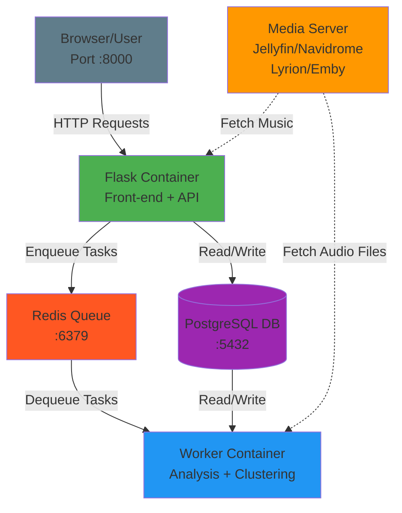

# Architecture

AudioMuse-AI follows a distributed architecture with separate containers for web interface, task processing, and data storage.

## System Architecture

## Component Responsibilities

### Flask Container
- **Web Interface**: Serves the front-end UI accessible at port 8000
- **REST API**: Provides endpoints for all AudioMuse-AI features
- **Task Orchestration**: Enqueues analysis and clustering jobs to Redis
- **Data Access**: Reads track information, playlists, and results from PostgreSQL
- **Media Server Integration**: Fetches music library metadata

### Worker Container
- **Job Processing**: Dequeues tasks from Redis queue
- **Audio Analysis**: Performs sonic analysis using Librosa and ONNX models
- **Clustering**: Executes playlist generation algorithms (KMeans, DBSCAN, GMM, Spectral)
- **Data Persistence**: Writes analysis results and embeddings to PostgreSQL
- **Audio Fetching**: Downloads audio files from media server for processing

### Redis Queue
- **Task Queue**: Stores pending analysis and clustering jobs
- **Job Status**: Tracks running and completed tasks
- **High Priority Queue**: Separate queue for priority tasks

### PostgreSQL Database
- **Track Metadata**: Stores song information, paths, and library data
- **Analysis Results**: Mood scores, embeddings, feature vectors
- **Playlists**: Generated clusters and user playlists
- **Voyager Index**: Vector similarity search index

### Media Server
- **Music Source**: Provides access to audio library
- **API Integration**: Jellyfin, Navidrome, Lyrion, or Emby APIs
- **Audio Streaming**: Streams audio files for analysis
- **Playlist Sync**: Target for generated playlists

## Data Flow

### Analysis Workflow
1. User triggers analysis via Flask UI
2. Flask enqueues analysis job to Redis
3. Worker dequeues job from Redis
4. Worker fetches audio from Media Server
5. Worker performs sonic analysis
6. Worker writes results to PostgreSQL
7. Flask reads results and displays to user

### Clustering Workflow
1. User starts clustering via Flask UI
2. Flask enqueues clustering job to Redis
3. Worker dequeues job from Redis
4. Worker reads track embeddings from PostgreSQL
5. Worker executes clustering algorithm
6. Worker writes generated playlists to PostgreSQL
7. Worker optionally syncs playlists to Media Server
8. Flask displays results to user

## Network Ports

| Service | Port | Protocol |
|---------|------|----------|
| Flask (Web UI + API) | 8000 | HTTP |
| Redis | 6379 | TCP |
| PostgreSQL | 5432 | TCP |
| Jellyfin | 8096 | HTTP |
| Navidrome | 4533 | HTTP |
| Lyrion | 9000 | HTTP |
| Emby | 8096 | HTTP |

## Deployment Modes

### Single Machine (Docker Compose)
All containers run on one host, communicating via Docker network.

### Distributed (Kubernetes)
- Flask, Worker, Redis, PostgreSQL deployed as separate pods
- Services expose internal endpoints
- Persistent volumes for database storage

### Remote Worker
- Flask + Redis + PostgreSQL on main server
- Worker on remote machine (closer to media server or with GPU)
- Worker connects using `POSTGRES_HOST` and `REDIS_URL` pointing to main server
- Copy `.env` to remote worker and update these values to reach main server

## Scalability

- **Multiple Workers**: Deploy additional worker containers for parallel processing
- **Redis Queue**: Handles job distribution across workers
- **PostgreSQL**: Single source of truth for all data
- **Stateless Flask**: Can run multiple Flask instances behind load balancer